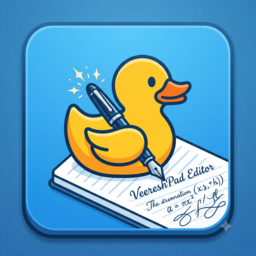

# DuckPad Editor

> A lightweight, cross-platform desktop text editor built with Python and PyQt5.

DuckPad Editor is a focused text editor designed for fast, distraction-free
writing and code editing. It includes useful editor features such as line
numbers, dark mode, recent files, font customization, zoom controls, and
single-file executable builds through PyInstaller.



## Highlights

- Clean desktop interface built with PyQt5
- Line numbers for easier code navigation
- Light and dark editor themes
- Open, save, and save-as file workflows
- Recent files menu
- Find and replace support
- Font selection and editor zoom with `Ctrl` + mouse wheel
- Status bar with cursor and document information
- Native executable builds for Windows, macOS, and Linux
- Linux builds avoid a known Qt/X11 window-icon crash in WSLg; the desktop
  launcher still displays the application icon

## Technology

- **Language:** Python 3
- **GUI:** PyQt5
- **Packaging:** PyInstaller
- **Image handling:** Pillow
- **Automation:** GitHub Actions

## Run from source

### 1. Clone the repository

```bash
git clone https://github.com/Veeresh-Hanni/Duckpad-Editor.git
cd "Duckpad-Editor"
```

### 2. Create a virtual environment

```bash
python -m venv .venv
```

Activate it on Windows:

```powershell
.venv\Scripts\Activate.ps1
```

Activate it on macOS or Linux:

```bash
source .venv/bin/activate
```

### 3. Install dependencies and launch

```bash
python -m pip install -r requirements.txt
python duckpad.py
```

## Build locally

The repository includes convenience scripts for local builds:

| Platform | Command | Output |
| --- | --- | --- |
| Windows | `build_win.bat` | `dist/DuckPad_Editor.exe` |
| macOS | `./build_mac.sh` | `dist/DuckPad_Editor-macos.dmg` |
| Linux | `./build_lin.sh` | `dist/duckpad`, `.deb`, and `.rpm` |

The local scripts also install the application on the host system. For a
portable build without installation, run PyInstaller directly:

```bash
pyinstaller --noconsole --onefile --name DuckPad_Editor duckpad.py
```

## CI/CD and releases

GitHub Actions builds the application on all three supported operating
systems. Every push and pull request runs the build matrix as a CI check.

To publish a release:

```bash
git tag v1.0.2
git push origin v1.0.2
```

The release workflow automatically:

1. Builds Windows, macOS, and Linux packages.
2. Creates a macOS `.dmg` installer.
3. Creates Linux `.deb` and `.rpm` system packages.
4. Archives portable builds for each platform.
5. Runs a headless startup smoke test to verify icon loading.
6. Verifies the executable, bundled icon, and installer files before publishing.
7. Creates a GitHub Release for the tag.
8. Uploads all installers and archives as release assets.

Install released packages system-wide:

- **Windows:** download and run `DuckPad_Editor-windows.zip`, then launch the
  executable.
- **macOS:** open `DuckPad_Editor-macos.dmg` and drag DuckPad Editor into
  Applications.
- **Debian/Ubuntu:** run `sudo apt install ./duckpad-editor_<version>_amd64.deb`.
- **Fedora/RHEL:** run `sudo dnf install ./duckpad-editor-<version>-1.x86_64.rpm`.

You can also download the latest successful build from the **Actions >
Build DuckPad Editor > Artifacts** page without creating a release.

### Clean Linux upgrade

Remove an older package before installing a fresh release:

```bash
sudo apt remove duckpad-editor
sudo apt autoremove
sudo apt install ./duckpad-editor_1.0.2_amd64.deb
duckpad
```

Release tags must be semantic versions in the form `vMAJOR.MINOR.PATCH`.
For a failed tag that has not been published successfully, remove and recreate
it before pushing:

```bash
git tag -d v1.0.2
git push origin --delete v1.0.2
git tag v1.0.2
git push origin v1.0.2
```

## Project structure

```text
Duckpad Editor/
├── duckpad.py          # Application source
├── duckpad.png         # Application icon and README screenshot
├── requirements.txt    # Runtime and build dependencies
├── build_win.bat       # Windows local installer build
├── build_mac.sh        # macOS local installer build
├── build_lin.sh        # Linux local installer build
└── .github/workflows/  # CI/CD automation
```

## Portfolio summary

DuckPad Editor demonstrates desktop GUI development, cross-platform
distribution, packaging with PyInstaller, and automated release engineering
with GitHub Actions. It is a compact example of taking a Python application
from source code to downloadable software artifacts.

## Author

**Veeresh Hanni**